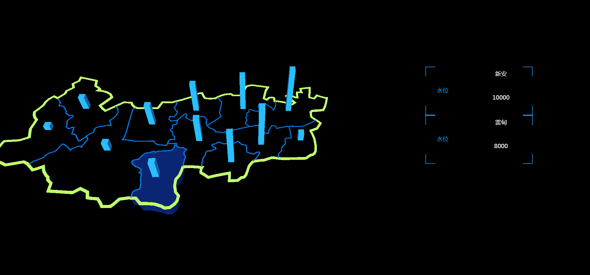

# three-demo-simple
- 重写自[这里](https://github.com/zy410419243/three-demo)  
  
- 文件引入用的require.js，至少调试的时候不会像老版那样伤眼  
  
- three升级至r91dev，api跟官方文档能对上了
  
# 怎么看demo
  clone下来，部署到本地服务器，打开index.html即可  
    
  比如我发布到IIS上，端口9005，最后在地址栏输入 http://localhost:9005 即可（IIS默认打开文件index.html） 
    
  用法也在demo里，因为代码挺长就不贴了

## 效果图
  
电脑渣，录的很卡，德芙版请部署到本地

# API

## Trunk对象上绑定的方法
| 名称 | 说明 | 用法 |
| :------: | ----- | :------: |
| init | 初始化方法， | Trunk.init(config) |
| get_object | 获得最新模型数据集 | Trunk.get_object() |
| refresh_pillar | 重新请求数据并刷新柱子, 需传入新的模型数据.  TODO 指定某对象刷新数据和模型 | Trunk.refresh_pillar(object) |
| show_texture | 设置等值面模型材质和贴图, 具体用法见下 | Trunk.show_texture(config, url) |

## Trunk.show_texture(config, url)
| 参数 | 说明 | 类型 | 默认值 |
| :------: | ----- | :------: | :------: |
| config | 控制等值面是否显示，visible可以不用传，其它属性和mesh.material中的属性对应，形如{ transparent: true, opacity: 0.5 } | {} | 无 |
| url | 等值面图的地址 | String | 无 |

## Trunk.init中config说明
| 参数 | 说明 | 类型 | 默认值 |
| :------: | ----- | :------: | :------: |
| container | 挂载画布的节点 | dom | 无 |
| divisor | 用于控制柱子高度，算法：柱子高度 = 当前模型中数据 / divisor * 15，也就是说divisor越小，柱子越高。一般是传数据中的最大值 | String或Number | 无 |
| clear_color | 画布颜色。颜色字符串，hex、十六进制都行 | String | transparent |
| clear_opacity | 画布透明度 | Float, [0, 1] | 0.2 |
| border_visible | 是否显示上下边界 | Boolean | false |
| mesh_shift_time | 定义各板块移动时间，单位毫秒 | Number | 2000 |
| texture | 设置鼠标移入、移出板块颜色变化 | {} | 无 |
| child_mapping | 手动设置模型贴图，可以理解为遍历模型数据时的回调 | Function, (child, config) => {} | 无 |
| light | 初始化光线，需要手动return光线实例数组 | Function, () => { return []; } | 无 |
| show_detail | 这方法主要是把点击的模型传出来，具体要做什么自己写，没这个方法点击板块是没反应的。返回值控制模型是否移动 | Function, (child) => { return Boolean; } | 无 |
| controls | 轨道控制参数。想看中文文档就去搜一下OrbitControls，直接一点就看./third/three/controls/OrbitControls | {} | 无 |
| data | 加载模型及业务数据，具体参数见下 | {} | 无 |
* 关于画布，默认是透明的，也就是白的。要改变背景颜色，一种是给clear_color和clear_opacity赋值，另一种是修改容器的background

## Trunk.init(config) -> config.勾子(生命周期)
| 参数 | 说明 | 类型 |
| :------: | ----- | :------: | :------: |
| before_init | 在加载模型之前、初始化参数之后的钩子，传出于默认值合并后的config | Function, (config) => {}  |
| set_material | 加载材料后、加载模型前的钩子，用于处理等值面之类的贴图，不预先处理的话，texture.map.image的尺寸没法确定。传出合并后的材料对象 | Function, (materials) => { return materials; }  |
| data.load | 勉强算是勾子，在加载材质和模型之后，在渲染之前，毕竟数据还没处理。本来写在类内，但想想数据处理太复杂就丢出来了。具体data中的参数 | Function, (object, goon) |

## Trunk.init(config) -> config.texture
| 参数 | 说明 | 类型 | 默认值 |
| :------: | ----- | :------: | :------: |
| line | 内部乡镇边界贴图 | String | 无 |
| pillar | 柱子贴图 | String | 无 |
| border | 边缘边界贴图 | String | 无 |
| top | 顶面贴图 | String | 无 |
| bottom | 底面贴图 | String | 无 |
| select | 鼠标移入时，整个板块贴图 | String | 无 |
* 这里的值都是颜色字符串，hex、十六进制都行，不传就是黑的。

## Trunk.init(config) -> config.data
| 参数 | 说明 | 类型 |
| :------: | ----- | :------: | :------: |
| materials | 材质文件路径，形如['./data/model/deqing04.mtl', './data/model/zhengti.mtl']，暂时只支持数组 | Array |
| objects | 模型文件路径，形如['./data/model/deqing04.obj', './data/model/zhengti.obj']，暂时只支持数组 | Array |
| load | 初次加载数据时执行的方法，object是合并后的模型对象，goon是处理完数据（使模型和业务数据对应）后需要执行的方法，执行完后得把新的模型数据传进去，形如goon(new_object) | Function, (object, goon) |

# 模型数据说明
假设模型的区域是浙江省，板块名字叫hangzhou
* 板块是杭州市这一块所在的区域，然后宁波也算个板块，这么多板块拼成的东西叫模型，模型内部及板块内部用line区分边界，模型外部用_border区分边界
* hangzhou是板块顶面的数据
* hangzhou_bottom是板块底面的数据
* line是杭州市下乡镇边界，目前的边界数据是所有乡镇边界都放一起的
* top_border是模型顶面边界，bottom_border是模型底面边界  
* hangzhou_pillar是板块中心的柱子
* texture用来贴等值面，实际上就是原先的模型复制一下轮廓
* 换句话说，obj文件里的名字只能是line、top_border、bottom_border、hangzhou 、hangzhou_bottom、hangzhou_pillar、texture，别的咱不管
  
嚷嚷这么多东西，其实用到的可能就只有改变材质的时候会用到这些概念

# License MIT